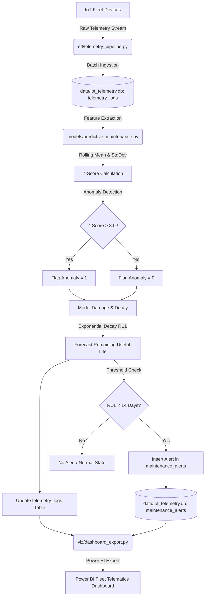

# IoT Telematics & Predictive Maintenance Portfolio

This repository contains an end-to-end data engineering and analytics pipeline for real-time IoT telematics and predictive maintenance. The system processes high-frequency sensor streams from a fleet of industrial devices, detects anomalies using rolling statistical metrics, models degradation patterns, estimates Remaining Useful Life (RUL) using exponential decay equations, and exposes structured data for dashboard reporting.

## Project Structure

```
├── data/
│   └── iot_telemetry.db                # SQLite database (generated by ETL)
├── db/
│   ├── schema.sql                      # Database DDL schema for SQLite
│   └── queries.sql                     # High-value analytics queries
├── etl/
│   └── telemetry_pipeline.py           # Ingestion script to simulate streaming telemetry logs
├── models/
│   └── predictive_maintenance.py       # ML/Analytical pipeline for anomaly scoring and RUL forecasting
├── viz/
│   ├── dashboard_export.py             # Script to generate a dark-mode dashboard preview
│   └── powerbi_iot_dashboard.png       # Generated dashboard graphic
├── requirements.txt                    # Project Python dependencies
└── README.md                           # Documentation and design system overview
```

---

## 1. Pipeline Architecture & Mathematical Models



### Anomaly Detection Metrics
The system computes rolling Z-scores on battery temperature ($T$) and motor vibration ($V$) to detect transient sensor anomalies. For each observation $x_t$ of device $d$:
1. **Rolling Mean ($\mu_t$)**: The rolling average over a window of $W = 50$ observations:
   $$\mu_t = \frac{1}{W} \sum_{i=0}^{W-1} x_{t-i}$$
2. **Rolling Standard Deviation ($\sigma_t$)**:
   $$\sigma_t = \sqrt{\frac{1}{W} \sum_{i=0}^{W-1} (x_{t-i} - \mu_t)^2}$$
3. **Z-Score ($Z_t$)**:
   $$Z_t = \frac{x_t - \mu_t}{\sigma_t}$$
An `anomaly_flag` is set to `1` if $|Z_{t, V}| > 3.0$ or $|Z_{t, T}| > 3.0$.

### Exponential Health Decay & Remaining Useful Life (RUL)
The asset health score $H_t$ is modeled as a continuous decay process starting at $100\%$ and degrading due to normal operational wear and anomaly-induced micro-damages:
$$H_t = H_{t-1} \cdot e^{-(\alpha \cdot \Delta t + \beta \cdot A_t)}$$
Where:
- $\Delta t$ is the elapsed time (in days) between consecutive telemetry records.
- $A_t \in \{0, 1\}$ is the `anomaly_flag`.
- $\alpha$ is the device-specific baseline degradation rate (wear).
- $\beta$ is the degradation penalty per anomaly event.

The **Remaining Useful Life (RUL)** in days is the time remaining for the health score to decay from its current value $H_t$ to the critical failure threshold $H_{fail} = 25.0\%$, assuming the effective daily decay rate $\lambda$:
$$RUL_t = \frac{\ln(H_t) - \ln(H_{fail})}{\lambda}$$
- Normal wear devices (DEV-001, DEV-002, DEV-004) use a decay coefficient $\lambda \approx 0.004$ ($RUL_{max} \approx 90$ days).
- High wear devices (DEV-003, DEV-005) use an accelerated wear coefficient $\lambda \approx 0.016$ ($RUL_{max} \approx 22$ days).

---

## 2. SQLite Database Schema

The SQLite schema consists of two main tables with optimized compound indexes for rapid query performance:

```sql
-- Telemetry Logs Table
CREATE TABLE IF NOT EXISTS telemetry_logs (
    log_id INTEGER PRIMARY KEY AUTOINCREMENT,
    device_id TEXT NOT NULL,
    timestamp DATETIME NOT NULL,
    battery_temp_c REAL NOT NULL,
    motor_vibration_g REAL NOT NULL,
    voltage REAL NOT NULL,
    rpm REAL NOT NULL,
    health_score REAL NOT NULL,
    anomaly_flag INTEGER DEFAULT 0
);

-- Maintenance Alerts Table
CREATE TABLE IF NOT EXISTS maintenance_alerts (
    alert_id INTEGER PRIMARY KEY AUTOINCREMENT,
    device_id TEXT NOT NULL,
    alert_timestamp DATETIME NOT NULL,
    alert_type TEXT NOT NULL,
    remaining_useful_life_days REAL NOT NULL,
    severity TEXT NOT NULL
);
```

---

## 3. Power BI Setup & Modeling Instructions

To ingest and visualize this data in Power BI, follow these instructions:

### Step 1: Connect to the SQLite Database
1. Open **Power BI Desktop**.
2. Click **Get Data** > **Blank Query** or search for the **ODBC** connector.
3. Configure an ODBC connection pointing to the SQLite database:
   - Create a System/User DSN in Windows ODBC Data Source Administrator using the **SQLite3 ODBC Driver**.
   - Set the database name path to `g:\IoT-Telematics-Predictive-Maintenance\data\iot_telemetry.db`.
   - Alternatively, load the SQLite database using a Python Script connector in Power BI:
     ```python
     import sqlite3
     import pandas as pd
     conn = sqlite3.connect("g:/IoT-Telematics-Predictive-Maintenance/data/iot_telemetry.db")
     telemetry_logs = pd.read_sql_query("SELECT * FROM telemetry_logs", conn)
     maintenance_alerts = pd.read_sql_query("SELECT * FROM maintenance_alerts", conn)
     conn.close()
     ```

### Step 2: Establish Relationships
In the **Model View** of Power BI, define relationships:
- Create a relationship between `telemetry_logs` and `maintenance_alerts` using `device_id` (1-to-many relationship, bidirectional cross-filtering).
- *Optional*: Create a dedicated `Calendar` table linked to `telemetry_logs(timestamp)` and `maintenance_alerts(alert_timestamp)` for time-intelligence reports.

### Step 3: Define DAX Measures
Create the following metrics in Power BI:
- **Total Fleet Anomalies**:
  ```dax
  Total Anomalies = SUM(telemetry_logs[anomaly_flag])
  ```
- **Average Fleet Health**:
  ```dax
  Avg Health Score = AVERAGE(telemetry_logs[health_score])
  ```
- **Active Critical Warnings**:
  ```dax
  Critical Alerts Count = CALCULATE(COUNT(maintenance_alerts[alert_id]), maintenance_alerts[severity] = "CRITICAL")
  ```
- **Device Current Remaining Useful Life (RUL)**:
  ```dax
  Current RUL Days = MIN(maintenance_alerts[remaining_useful_life_days])
  ```

---

## 4. How to Run the Pipeline

1. Install the required Python dependencies:
   ```bash
   pip install -r requirements.txt
   ```

2. Run the ingestion pipeline (ETL) to generate the raw dataset (10,000+ records):
   ```bash
   python etl/telemetry_pipeline.py
   ```

3. Run the ML & predictive model to compute Z-scores, health score decay, and maintenance alerts:
   ```bash
   python models/predictive_maintenance.py
   ```

4. Generate the dark-mode dashboard graphic:
   ```bash
   python viz/dashboard_export.py
   ```

The dashboard preview is saved to [viz/powerbi_iot_dashboard.png](file:///g:/IoT-Telematics-Predictive-Maintenance/viz/powerbi_iot_dashboard.png).
